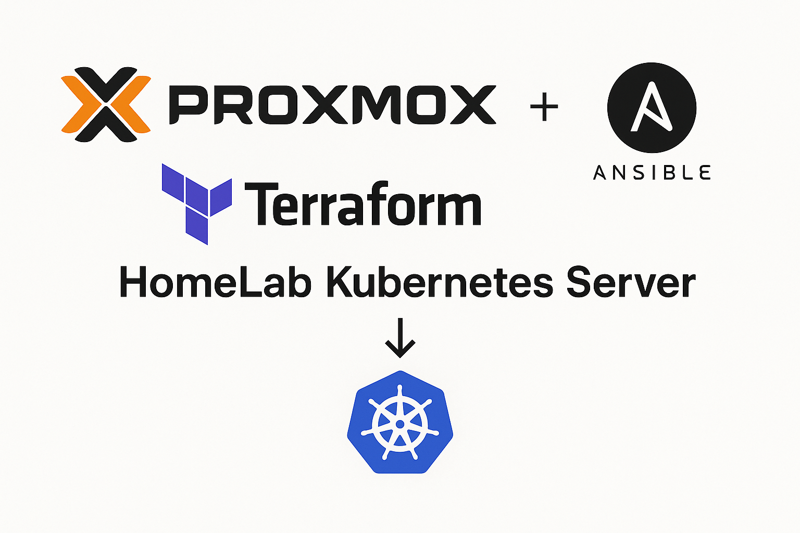

# Proxmox k3s Cluster with Terraform + Ansible



Automated deployment of a dev-ready K3s Kubernetes cluster on Proxmox VE using Infrastructure as Code principles with Terraform and Ansible.

## 📋 Table of Contents

1. [Overview & Architecture](#overview--architecture)
2. [Prerequisites](#prerequisites)
3. [Step 1: SSH Key Setup](#step-1-ssh-key-setup)
4. [Step 2: Configuration](#step-2-configuration)
5. [Step 3: Deploy Infrastructure](#step-3-deploy-infrastructure)
6. [Step 4: Access Your Cluster](#step-4-access-your-cluster)
7. [Step 5: Test Your Cluster](#step-5-test-your-cluster)
8. [Step 6: Cleanup (Optional)](#step-6-cleanup-optional)
9. [Advanced Topics](#advanced-topics)
10. [Troubleshooting](#troubleshooting)

## Overview & Architecture

### What This Project Does
- **Provisions VMs** on Proxmox VE using Terraform
- **Configures K3s cluster** using Ansible
- **Organizes resources** with pools and tags
- **Provides testing tools** for validation

### Architecture Components
- **1 Master node** (k3s server) - runs the Kubernetes control plane
- **3 Worker nodes** (k3s agents) - run workloads and pods  
- **Proxmox pool** for VM organization (`k8s`)
- **VM tags** for categorization (`k3s`, `master`, `worker`, `terraform`)
- **Private network** communication (192.168.99.0/24)
- **Automated SSH key management** for secure access

### Important Notes
- ✅ **Tested on**: AlmaLinux 9 VMs with cloud-init templates
- ⚠️ **WSL Limitation**: File system issues with Ansible and private keys
- ❌ **LXC Not Supported**: Kubernetes swap memory configuration errors
- 🔧 **Requirements**: Cloud-init template with SSH key injection

## Prerequisites

Before starting, ensure you have:

### On Your Local Machine
- **Terraform** >= 1.0
- **Ansible** >= 2.9  
- **sshpass** (for Ansible SSH connections)
- **kubectl** (for cluster management)
- **git** (for cloning the repository)

### On Proxmox VE
- **Proxmox VE** with API access
- **Cloud-init template** (AlmaLinux 9 recommended)
- **Network configuration** for VM communication
- **Storage** for VM disks and templates

## Step 1: SSH Key Setup

Before deploying the cluster, you need to generate SSH keys for secure access.

### 1.1 Generate Terraform/Ansible Access Keys

These keys will be used by Terraform and Ansible to access and configure the VMs:

```bash
# Generate SSH key pair for external access
ssh-keygen -t ed25519 -C "terraform@proxmox.dev" -f ~/.ssh/id_ed25519

# Set correct permissions
chmod 600 ~/.ssh/id_ed25519
```

**When prompted, press enter to leave the passphrase blank.**

### 1.2 Generate K3s Cluster Inter-Node Communication Keys

These keys enable secure communication between cluster nodes:

```bash
# Create ansible keys directory
mkdir -p ansible/keys/

# Generate RSA key pair for cluster communication
ssh-keygen -t rsa -b 2048 -C "k3s-cluster@proxmox" -f ansible/keys/k3s_cluster_key

# Set correct permissions
chmod 600 ansible/keys/k3s_cluster_key
chmod 644 ansible/keys/k3s_cluster_key.pub
```

**When prompted, press enter to leave the passphrase blank.**

### Key Usage Summary
- **`~/.ssh/id_ed25519`**: External access from your machine to VMs
- **`ansible/keys/k3s_cluster_key`**: Inter-node communication within the cluster
- **Security**: Keys are excluded from git via `.gitignore`

## Step 2: Configuration

Now configure the project for your environment.

### 2.1 Navigate to Terraform Directory

```bash
cd terraform/
```

### 2.2 Configure terraform.tfvars

Edit `terraform.tfvars` with your environment details:

```hcl
# Proxmox API Access
pm_api_url = "https://192.168.99.6:8006/api2/json"
pm_user     = "root@pam"
pm_password = "your-password"

# Infrastructure
target_node = "pve1"
template_name = "almalinux9-cloud"

# Network Configuration  
ip_base      = "192.168.99"
network_cidr = 24
gateway      = "192.168.99.1"

# SSH Access
ssh_public_key = "ssh-ed25519 AAAAC3NzaC1lZDI1NTE5AAAAINjLQ2DQTiXQbsbJ2ol2pNsyyEYCVAJqlDhPvS8DfZ++ terraform@proxmox.dev"
private_key_path = "~/.ssh/id_ed25519"
```

### Configuration Parameters Explained

| Parameter | Description | Example |
|-----------|-------------|---------|
| `pm_api_url` | Proxmox API URL | `https://192.168.99.6:8006/api2/json` |
| `pm_user` | Proxmox username | `root@pam` |
| `pm_password` | Proxmox password | `your-password` |
| `target_node` | Proxmox node name | `pve1` |
| `template_name` | Cloud-init template | `almalinux9-cloud` |
| `ip_base` | Network base | `192.168.99` |
| `ssh_public_key` | Your public key content | Copy from `~/.ssh/id_ed25519.pub` |

**Important**: Copy the content of `~/.ssh/id_ed25519.pub` into the `ssh_public_key` field.

## Step 3: Deploy Infrastructure

Now deploy the K3s cluster infrastructure.

### 3.1 Automated Deployment (Recommended)

Return to the project root and run the deployment script:

```bash
# Return to project root
cd ..

# Run the automated deployment script
./deploy.sh
```

**What the script does:**
- ✅ Checks all prerequisites (SSH keys, configuration files, tools)
- ✅ Shows deployment summary with your configuration
- ✅ Runs terraform init, validate, plan, and apply automatically
- ✅ Triggers Ansible playbooks to configure K3s
- ✅ Provides post-deployment instructions
- ✅ Handles errors gracefully with colored output

### 3.2 Manual Deployment (Alternative)

If you prefer manual control:

```bash
cd terraform/
terraform init
terraform validate
terraform plan
terraform apply
```

**Confirm the terraform apply by typing "yes" and wait for deployment to complete.**

### 3.3 What Happens During Deployment

1. **Terraform Phase** (5-10 minutes):
   - Creates VMs on Proxmox
   - Configures networking and storage
   - Applies cloud-init configuration
   - Sets up SSH access

2. **Ansible Phase** (5-10 minutes):
   - Installs K3s on master node
   - Configures worker nodes
   - Sets up cluster networking
   - Distributes SSH keys

**Total deployment time: ~10-20 minutes**

## Destroying the Infrastructure

When you need to completely remove the K3s cluster and all associated resources:

### Option 1: Using the Automated Destroy Script (Recommended)

```bash
# Run the automated destroy script from project root
./destroy.sh
```

The script will:
- Check prerequisites and show what will be destroyed
- Backup your kubeconfig file automatically
- Create a destroy plan and ask for confirmation
- Require typing 'DESTROY' in capitals for final confirmation
- Safely remove all VMs, pools, and configurations
- Provide post-destroy cleanup recommendations

### Option 2: Manual Destroy

```bash
cd terraform/
terraform plan -destroy
terraform destroy
```

⚠️ **Warning**: Destroying the infrastructure will permanently delete:
- All VMs and their data
- All Kubernetes workloads and persistent volumes
- All cluster configurations
- Proxmox pool and VM tags

This action cannot be undone!

## Ansible Integration

Ansible is automatically triggered by Terraform via `null_resource` provisioners. The process:

1. **Terraform creates VMs** with cloud-init configuration
2. **Waits for SSH availability** on each node
3. **Runs master playbook** (`../ansible/install-master.yml`)
4. **Runs worker playbooks** (`../ansible/install-workers.yml`) 
5. **Workers join the cluster** using tokens from master

The Ansible playbooks handle:
- Package installation (k3s, dependencies)
- SSH key distribution for inter-node communication
- K3s master initialization
- Worker node joining with proper tokens
- Shell configuration (zsh with antigen)

## Step 4: Access Your Cluster

After successful deployment, access your K3s cluster.

### 4.1 Get Cluster Information

```bash
# Navigate to terraform directory
cd terraform/

# View all deployment outputs
terraform output
```

### 4.2 Copy Kubeconfig

```bash
# Get the kubeconfig copy command
terraform output kubeconfig_command

# Execute the displayed scp command (example):
# scp -i ~/.ssh/id_ed25519 root@192.168.99.230:~/.kube/config ./kubeconfig
```

### 4.3 Test Cluster Connectivity

```bash
# Test cluster access
kubectl --kubeconfig ./kubeconfig get nodes
```

**Expected output:**
```bash
NAME         STATUS   ROLES                  AGE   VERSION
k3s-master   Ready    control-plane,master   5m    v1.27.5+k3s1
k3s-node1    Ready    <none>                 4m    v1.27.5+k3s1
k3s-node2    Ready    <none>                 4m    v1.27.5+k3s1
k3s-node3    Ready    <none>                 4m    v1.27.5+k3s1
```

### 4.4 SSH Access to Nodes

```bash
# SSH to master node
ssh -i ~/.ssh/id_ed25519 root@192.168.99.230

# SSH to worker nodes
ssh -i ~/.ssh/id_ed25519 root@192.168.99.231
ssh -i ~/.ssh/id_ed25519 root@192.168.99.232
ssh -i ~/.ssh/id_ed25519 root@192.168.99.233
```

## Step 5: Test Your Cluster

Validate your K3s cluster functionality with a comprehensive test application.

### 5.1 Deploy Test Application

```bash
# Navigate to helm directory
cd ../helm/

# Deploy test application
./deploy-test-app.sh
```

**What the test application provides:**
- ✅ **3 nginx replicas** with custom content
- ✅ **NodePort service** for direct IP access
- ✅ **Load balancing** across worker nodes
- ✅ **Automated tests** to verify connectivity
- ✅ **Real-time monitoring** of cluster status

### 5.2 Access the Test Application

**Direct IP Access (Recommended):**
```bash
# Access via NodePort on master IP
http://192.168.99.230:30080
```

**Port Forward (Alternative):**
```bash
kubectl port-forward -n k3s-test svc/k3s-test-app 8080:80
# Visit: http://localhost:8080
```

### 5.3 What the Test Validates

The test application confirms:
- 🚀 **Container Runtime** - containerd pulling and running images
- 🌐 **Service Discovery** - Internal DNS and service mesh
- ⚖️ **Load Balancing** - Traffic distribution across pods
- 🔗 **Networking** - Pod-to-pod and external communication
- 📦 **ConfigMaps** - Configuration injection and mounting
- 🔍 **Health Checks** - Liveness and readiness probes

### 5.4 Monitor the Test

```bash
# Check pods across nodes
kubectl get pods -n k3s-test -o wide

# View service details
kubectl get svc -n k3s-test

# Watch logs
kubectl logs -n k3s-test -l app.kubernetes.io/name=k3s-test-app -f
```

## Step 6: Cleanup (Optional)

When you're done testing or want to remove resources.

### 6.1 Cleanup Test Application

**Automated Cleanup (Recommended):**
```bash
# From helm directory
./destroy-test-app.sh
```

**Manual Cleanup:**
```bash
helm uninstall k3s-test-app -n k3s-test
kubectl delete namespace k3s-test
```

### 6.2 Destroy Infrastructure

**Automated Destruction (Recommended):**
```bash
# Return to project root
cd ..

# Run destroy script
./destroy.sh
```

**Manual Destruction:**
```bash
cd terraform/
terraform plan -destroy
terraform destroy
```

⚠️ **Warning**: This will permanently delete all VMs, data, and configurations!

---

## Advanced Topics

### VM Organization

### Proxmox Pool
All VMs are organized in a Proxmox pool named `k8s` for:
- Resource management and allocation
- Backup policy application
- Access control and permissions
- Cost tracking and reporting

### VM Tags
- **Master nodes**: `k3s,master,terraform`
- **Worker nodes**: `k3s,worker,terraform`

## SSH Access

Connect to cluster nodes using the generated SSH keys:

```bash
# Master node
ssh -i ~/.ssh/id_ed25519 root@192.168.99.230

# Worker nodes  
ssh -i ~/.ssh/id_ed25519 root@192.168.99.231
ssh -i ~/.ssh/id_ed25519 root@192.168.99.232
ssh -i ~/.ssh/id_ed25519 root@192.168.99.233
```

## Testing the Cluster with Nginx

Test your cluster by deploying a simple Nginx service:

```bash
# Create nginx deployment
kubectl --kubeconfig ./kubeconfig create deployment nginx --image=nginx

# Expose as NodePort service
kubectl --kubeconfig ./kubeconfig expose deployment nginx --port=80 --type=NodePort

# Get service details
kubectl --kubeconfig ./kubeconfig get services
```

Access the service using any node IP and the assigned NodePort.

## Security Features

- **SSH key-based authentication** - no password access
- **Inter-node communication** via dedicated SSH keys
- **Private network isolation** - cluster on dedicated subnet
- **Cloud-init security** - automated secure initialization
- **Sensitive variable protection** - marked sensitive in Terraform

### Security Best Practices

- Store sensitive values in environment variables:
```bash
export TF_VAR_pm_password="your-password"
export TF_VAR_ssh_password="your-ssh-password"
```

- Consider HashiCorp Vault for production secret management
- Implement network segmentation and firewalls
- Regular security updates via Ansible automation

## Advanced Configuration

### Remote State Backend

For production use, configure remote state storage:

```hcl
terraform {
  backend "s3" {
    bucket = "your-terraform-state"
    key    = "k3s-cluster/terraform.tfstate"
    region = "us-east-1"
  }
}
```


### High Availability // TODO

Scale the master nodes for HA: 

```hcl
# In terraform.tfvars // TODO
master_count = 3
```

### Custom K3s Configuration

Modify Ansible playbooks to customize K3s:
- Add custom registries
- Configure storage classes
- Install additional components

## Troubleshooting

### Common Issues

**SSH Connection Failures:**
- Verify SSH keys are correctly configured
- Check network connectivity to VMs
- Ensure cloud-init has completed

**Terraform State Locks:**
```bash
# Only if absolutely necessary
terraform apply -lock=false
```

**Ansible Playbook Failures:**
- Add verbose output: `ansible-playbook -vvv`
- Check SSH access manually
- Verify sudo permissions

**K3s Join Failures:**
- Check token availability on master
- Verify network connectivity on port 6443
- Review k3s logs: `journalctl -u k3s`

### Debugging Commands

```bash
# Terraform debugging
terraform apply -debug

# Check VM status in Proxmox
qm list

# Test SSH connectivity
ssh -o ConnectTimeout=5 -i ~/.ssh/id_ed25519 root@192.168.99.230 'echo "Connection successful"'

# K3s cluster status
kubectl --kubeconfig ./kubeconfig cluster-info
kubectl --kubeconfig ./kubeconfig get nodes -o wide
```

## Local kubectl Setup

For convenient local access, install kubectl on your workstation:

### Ubuntu/Debian Systems

```bash
sudo apt-get update
sudo apt-get install -y apt-transport-https ca-certificates curl gnupg

curl -fsSL https://pkgs.k8s.io/core:/stable:/v1.28/deb/Release.key | sudo gpg --dearmor -o /etc/apt/keyrings/kubernetes-apt-keyring.gpg
sudo chmod 644 /etc/apt/keyrings/kubernetes-apt-keyring.gpg

echo 'deb [signed-by=/etc/apt/keyrings/kubernetes-apt-keyring.gpg] https://pkgs.k8s.io/core:/stable:/v1.28/deb/ /' | sudo tee /etc/apt/sources.list.d/kubernetes.list
sudo chmod 644 /etc/apt/sources.list.d/kubernetes.list

sudo apt-get update
sudo apt-get install -y kubectl
```

### RHEL/AlmaLinux/CentOS/Fedora Systems

```bash
# Add Kubernetes repository
cat <<EOF | sudo tee /etc/yum.repos.d/kubernetes.repo
[kubernetes]
name=Kubernetes
baseurl=https://pkgs.k8s.io/core:/stable:/v1.28/rpm/
enabled=1
gpgcheck=1
gpgkey=https://pkgs.k8s.io/core:/stable:/v1.28/rpm/repodata/repomd.xml.key
EOF

# Install kubectl
sudo dnf install -y kubectl

# Or for older RHEL/CentOS versions:
# sudo yum install -y kubectl
```

### macOS Systems

#### Using Homebrew (recommended):
```bash
# Install Homebrew if not already installed
/bin/bash -c "$(curl -fsSL https://raw.githubusercontent.com/Homebrew/install/HEAD/install.sh)"

# Install kubectl
brew install kubectl
```

#### Using curl (alternative):
```bash
# Download kubectl binary
curl -LO "https://dl.k8s.io/release/$(curl -L -s https://dl.k8s.io/release/stable.txt)/bin/darwin/amd64/kubectl"

# Make it executable
chmod +x ./kubectl

# Move to PATH
sudo mv ./kubectl /usr/local/bin/kubectl
```

### Configure kubectl Access

Copy the kubeconfig to your local machine:
```bash
mkdir -p $HOME/.kube/
scp -i ~/.ssh/id_ed25519 root@192.168.99.230:~/.kube/config $HOME/.kube/config

# Test local access
kubectl get nodes
```

## Helm Installation

Install Helm for package management:

```bash
curl -fsSL -o get_helm.sh https://raw.githubusercontent.com/helm/helm/main/scripts/get-helm-3
chmod 700 get_helm.sh
./get_helm.sh
```

## Project Structure

```
├── README.md                    # This documentation
├── ansible/                     # Ansible configuration
│   ├── ansible.cfg             # Ansible settings
│   ├── install-master.yml      # Master node playbook
│   ├── install-workers.yml     # Worker nodes playbook
│   ├── keys/                   # SSH keys for inter-node communication
│   │   ├── k3s_cluster_key     # Private key (600 permissions)
│   │   └── k3s_cluster_key.pub # Public key
│   └── templates/
│       └── zshrc.j2           # Shell configuration template
└── terraform/                  # Terraform configuration
    ├── Makefile               # Automation helpers
    ├── main.tf                # VM resources and Ansible integration
    ├── variables.tf           # Variable definitions
    ├── terraform.tfvars       # Environment configuration
    ├── outputs.tf             # Useful outputs
    ├── versions.tf            # Provider configuration
    └── pool.tf                # Proxmox pool definition
```

## Contributing

1. Fork the repository
2. Create a feature branch (`git checkout -b feature/amazing-feature`)
3. Commit your changes (`git commit -m 'Add amazing feature'`)
4. Push to the branch (`git push origin feature/amazing-feature`)
5. Open a Pull Request

## Acknowledgments

- [K3s](https://k3s.io/) - Lightweight Kubernetes distribution
- [Proxmox VE](https://www.proxmox.com/) - Virtualization platform
- [Terraform](https://www.terraform.io/) - Infrastructure as Code
- [Ansible](https://www.ansible.com/) - Configuration management
 
 ## Roadmap
 
 - Dynamic inventory from Terraform outputs (Ansible plugin or `terraform output -json`)
 - TLS, users, and hardened SSH configuration
 - Add-on helm charts (metrics-server, ingress, cert-manager)
 - CI workflow (fmt/validate/plan) and pre-commit hooks
  
 ## License
  
  MIT
