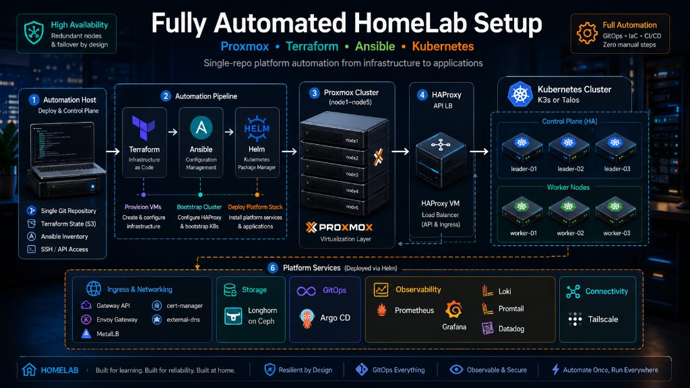

# Homelab — Proxmox + Kubernetes

Terraform for Proxmox VMs, Ansible or Talos for the cluster, Helm for the
platform charts (K3s or Talos).



## Quick start

```bash
cp secrets.env.example secrets.env   # fill secrets + toggles
# Edit VM sizing / Proxmox placement:
#   terrafrom/linux/terraform.tfvars
#   terrafrom/talos-linux/terraform.tfvars

./deploy-infra.sh -y --os=linux     # Debian + K3s
./deploy-infra.sh -y --os=talos     # Talos Linux + talosctl
./destroy-infra.sh -y --os=talos    # tear down matching stack
```

`./deploy-infra.sh --help` for all flags.

## Architecture

| Layer | Role |
|-------|------|
| Deploy host | `deploy-infra.sh` — Terraform, Ansible/talosctl, Helm, kubectl |
| Proxmox | Hypervisor cluster (`node1`…`node5`) |
| HAProxy LB VM | Kubernetes API on `.210:6443` (always Debian) |
| Control plane | 3 leaders (`.220+`) — K3s or Talos |
| Workers | 3 workers (`.230+`) + Longhorn data disk |
| MetalLB / Gateway | Ingress `.211` → `*.GATEWAY_DOMAIN` |

Full diagram and notes: [docs/architecture.md](docs/architecture.md) · [docs/img/](docs/img/).

## Platform OS

| `--os` | Terraform | Bootstrap |
|--------|-----------|-----------|
| `linux` | `terrafrom/linux/` | Ansible K3s |
| `talos` | `terrafrom/talos-linux/` | HAProxy on LB + `bootstrap-talos.sh` |

CLI `--os=` overrides `TALOS_ENABLED` in `secrets.env`.

Bulgarian walkthrough: [docs/platform-os-bg.md](docs/platform-os-bg.md).

## Config split

| File | Contents |
|------|----------|
| `secrets.env` | Secrets, network, cluster size, **platform toggles** |
| `terrafrom/linux/terraform.tfvars` | K3s VM sizing, placement, HA, PBS |
| `terrafrom/talos-linux/terraform.tfvars` | Talos VM sizing, placement |

Deploy writes `secrets.auto.tfvars` into the **active** stack only.

## Platform toggles

Each `*_ENABLED` flag has its own doc under [docs/toggles/](docs/toggles/README.md):

| Toggle | Doc |
|--------|-----|
| `CEPH_STORAGE` | [ceph-storage](docs/toggles/ceph-storage.md) |
| `LONGHORN_ENABLED` | [longhorn](docs/toggles/longhorn.md) |
| `SNAPSHOT_CONTROLLER_ENABLED` | [snapshot-controller](docs/toggles/snapshot-controller.md) |
| `GATEWAY_ENABLED` | [gateway](docs/toggles/gateway.md) |
| `EXTERNAL_DNS_ENABLED` | [external-dns](docs/toggles/external-dns.md) |
| `PROMETHEUS_ENABLED` | [prometheus](docs/toggles/prometheus.md) |
| `ALERTMANAGER_ENABLED` | [alertmanager](docs/toggles/alertmanager.md) |
| `LOKI_ENABLED` | [loki](docs/toggles/loki.md) |
| `ARGOCD_ENABLED` | [argocd](docs/toggles/argocd.md) |
| `ARGOCD_BOOTSTRAP_ENABLED` | [argocd-bootstrap](docs/toggles/argocd-bootstrap.md) |
| `SEALED_SECRETS_ENABLED` | [sealed-secrets](docs/toggles/sealed-secrets.md) |
| `RELOADER_ENABLED` | [reloader](docs/toggles/reloader.md) |
| `VELERO_ENABLED` | [velero](docs/toggles/velero.md) |
| `KASTEN_ENABLED` | [kasten](docs/toggles/kasten.md) |
| `DATADOG_ENABLED` | [datadog](docs/toggles/datadog.md) |
| `TAILSCALE_ENABLED` | [tailscale](docs/toggles/tailscale.md) |
| `TAILSCALE_EXPORTER_ENABLED` | [tailscale-exporter](docs/toggles/tailscale-exporter.md) |
| `TRIVY_OPERATOR_ENABLED` | [trivy-operator](docs/toggles/trivy-operator.md) |

Setting a flag to `false` **skips** install on the next deploy; it does **not** uninstall an already-running component.

## Before you run

**Deploy host:** `terraform` (or `tofu`), `ansible-playbook`, `kubectl`, `helm`, `python3`, `talosctl` (Talos only).

**Proxmox:** API token; Debian template for LB (`TEMPLATE_*`); Talos template for CP/workers when `--os=talos` (`TALOS_TEMPLATE_*`).

**Network:** `IP_BASE`, gateway, DNS in `secrets.env`. API LB ≠ Gateway IP (e.g. `.210` vs `.211`).

With `CEPH_STORAGE=true`, deploy uses `terraform -parallelism=1` automatically.

## After deploy

```bash
export KUBECONFIG=kubeconfigs/<ENV_ID>.kubeconfig
kubectl get nodes
```

Helm-only re-run:

```bash
./deploy-infra.sh --helm-only --os=talos
```

## Documentation

| Doc | Description |
|-----|-------------|
| [docs/README.md](docs/README.md) | Documentation index |
| [docs/getting-started.md](docs/getting-started.md) | Step-by-step first deploy |
| [docs/architecture.md](docs/architecture.md) | Architecture and IP layout |
| [docs/toggles/](docs/toggles/README.md) | One page per platform toggle |
| [docs/proxmox.md](docs/proxmox.md) | Proxmox API + templates |
| [docs/platform.md](docs/platform.md) | Hostnames and sizing |
| [docs/cloudflare-gateway.md](docs/cloudflare-gateway.md) | Gateway / TLS / DNS-01 |
| [docs/platform-os-bg.md](docs/platform-os-bg.md) | OS choice (Bulgarian) |
| [summary.md](summary.md) | Local operator notes (gitignored) |
