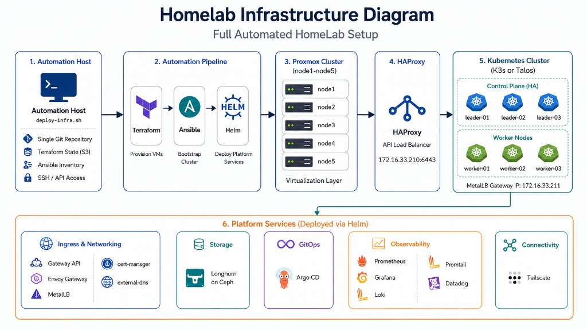

# Architecture



## Pipeline

```
deploy-infra.sh
  → Terraform (Proxmox VMs)
  → Ansible (K3s)  OR  Ansible HAProxy + bootstrap-talos.sh (Talos)
  → Helm platform stack (feature toggles)
```

Core logic: `scripts/lib/common.sh`. Orchestrators: `deploy-infra.sh`,
`destroy-infra.sh`.

## Current layout (example)

Assumes `IP_BASE=172.16.33`, `ENV_ID=k8s-homelab`, `LEADER_COUNT=3`,
`WORKER_COUNT=3`.

| Role | Example name | IP | Notes |
|------|--------------|-----|--------|
| API LB | `k8s-homelab-lb` | `.210` | Debian + HAProxy `:6443` |
| Control plane | `…-leader-01..03` | `.220–.222` | K3s or Talos |
| Workers | `…-worker-01..03` | `.230–.232` | Longhorn data disk |
| Gateway | MetalLB | `.211` | Envoy Gateway HTTP(S) |

API LB is `.210`; ingress/MetalLB is `.211` — different roles.

## Proxmox

Five hosts: `node1` … `node5`. VM placement is set per stack in
`terrafrom/*/terraform.tfvars`. With `CEPH_STORAGE=true`, VM disks use
`ceph-prod` (or your `ceph_datastore_id`). With `CEPH_STORAGE=false`, disks use
`PROXMOX_DATASTORE_ID` (e.g. NFS `SSD-storage`) and stay multi-node when
`PROXMOX_SHARED_STORAGE=true`.

## Platform stack (Helm)

Controlled by toggles in `secrets.env` — see [toggles/](toggles/README.md).

## Screenshots

- [img/longhorn-dashboard.png](img/longhorn-dashboard.png) — Longhorn volumes / storage nodes
- [img/grafana-homelab-dashboards.png](img/grafana-homelab-dashboards.png) — Homelab Grafana folder
- [img/grafana-k8s-views-global.png](img/grafana-k8s-views-global.png) — Cluster overview
- [img/grafana-logging-loki.png](img/grafana-logging-loki.png) — Loki logging
- [img/grafana-cert-manager.png](img/grafana-cert-manager.png) — Wildcard certificate

## Related

- [getting-started.md](getting-started.md)
- [platform-os-bg.md](platform-os-bg.md)
- [../summary.md](../summary.md)
