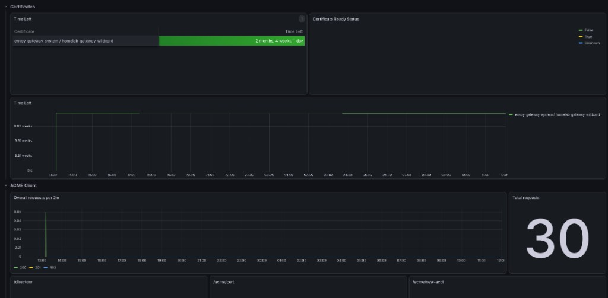

# GATEWAY_ENABLED

LAN HTTPS ingress via **Gateway API** + Envoy Gateway + MetalLB + cert-manager.



## Enable

```bash
GATEWAY_ENABLED=true
GATEWAY_LB_IP=172.16.33.211
GATEWAY_DOMAIN=homelab.panev.cloud
ACME_EMAIL=you@example.com
CLOUDFLARE_API_TOKEN=...
CLOUDFLARE_DNS_PROXIED=false
LETSENCRYPT_STAGING=false
```

## Behavior

1. MetalLB IP pool → `GATEWAY_LB_IP`
2. Envoy Gateway + Gateway / Certificate manifests
3. cert-manager ClusterIssuer (Cloudflare DNS-01)
4. HTTPRoutes for platform UIs (Grafana, Argo CD, Longhorn, Kasten, …)

Full TLS/DNS detail: [../cloudflare-gateway.md](../cloudflare-gateway.md).

When `KASTEN_ENABLED=true`, deploy applies
`helm-homelab/gateway/manifests/httproutes/kasten.yaml.tpl` →
`https://kasten.<GATEWAY_DOMAIN>/k10/`.

## Configuration

| Variable | Description |
|----------|-------------|
| `GATEWAY_LB_IP` | MetalLB address (≠ API LB `.210`) |
| `GATEWAY_DOMAIN` | Base domain for HTTPRoutes |
| `ACME_EMAIL` | Let's Encrypt account email |
| `CLOUDFLARE_API_TOKEN` | DNS-01 + shared with external-dns |
| `CLOUDFLARE_DNS_PROXIED` | Must be `false` for private LAN IP |
| `LETSENCRYPT_STAGING` | Staging CA for tests |

Values / manifests: `helm-homelab/envoy-gateway/`, `helm-homelab/cert-manager/`,
`helm-homelab/gateway/manifests/`, `helm-homelab/metallb/`.

## Verify

```bash
kubectl get gateway -A
kubectl get certificate -A
curl -kI https://grafana.${GATEWAY_DOMAIN}
```

## Related

- [external-dns.md](external-dns.md)
- [../cloudflare-gateway.md](../cloudflare-gateway.md) — Universal SSL / DNS-01 pitfalls
