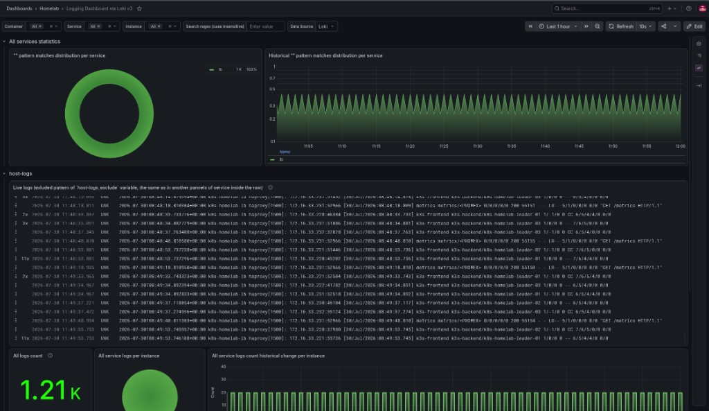

# LOKI_ENABLED

Central log store (**Loki**) plus **Promtail** on VMs that can run syslog agents.



## Enable

```bash
PROMETHEUS_ENABLED=true
LOKI_ENABLED=true
LOKI_RETENTION=168h
LOKI_STORAGE_SIZE=20Gi
LOKI_GATEWAY_NODE_PORT=31080
```

## Behavior

| Piece | Detail |
|-------|--------|
| Loki | Helm SingleBinary on Longhorn PVC (namespace `monitoring`) |
| Grafana | Loki datasource overlay injected at deploy |
| Promtail | Ansible `deploy-promtail.yml` |

### Promtail hosts

| OS | Where Promtail runs |
|----|---------------------|
| `--os=linux` | LB + all leaders + workers |
| `--os=talos` | **LB VM only** (Talos has no SSH / traditional host syslog) |

Talos **machine** logs need a separate path (`machine.logging` → Vector/Alloy →
Loki). Not shipped by this toggle today. Use `talosctl logs` for ad-hoc.

## Configuration

| Variable | Description |
|----------|-------------|
| `LOKI_RETENTION` | Log retention in Loki |
| `LOKI_STORAGE_SIZE` | PVC size |
| `LOKI_GATEWAY_NODE_PORT` | NodePort Promtail pushes to |
| Helm | `helm-homelab/loki/values.yaml` |
| Promtail | `ansible/roles/promtail/` |

Dashboard **24574** labels: `container_name`, `service_name`, `instance`
(e.g. `haproxy` / `lb` / `k8s-homelab-lb`).

## Verify

```bash
kubectl get pods -n monitoring | grep loki
# Grafana → Homelab → Logging Dashboard via Loki v3
```

## Related

- [prometheus.md](prometheus.md)
- [longhorn.md](longhorn.md)
