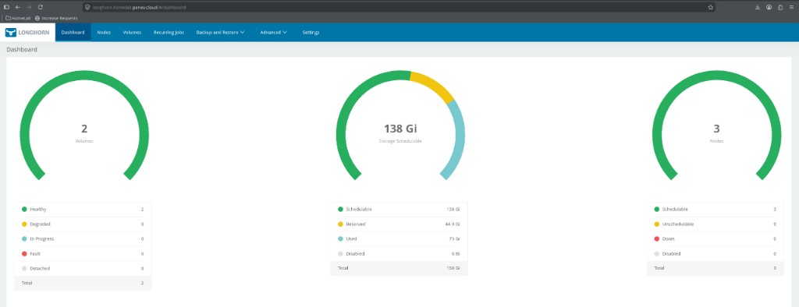

# LONGHORN_ENABLED

Distributed block storage for Kubernetes PVCs. Default StorageClass when enabled.



## Enable

```bash
LONGHORN_ENABLED=true
WORKER_DATA_DISK_GB=50
LONGHORN_MOUNT_PATH=/var/mnt/longhorn-data
LONGHORN_DATA_DISK_FSTYPE=xfs
LONGHORN_HOSTNAME=longhorn
```

## Behavior

- Attaches a dedicated **scsi1** data disk to each worker (Terraform)
- **K3s:** Ansible `longhorn_disk` formats/mounts the disk
- **Talos:** `bootstrap-talos.sh` UserVolumeConfig mounts the same path
- Helm chart `longhorn` → namespace `longhorn-system`
- HTTPRoute when Gateway is on: `https://longhorn.<GATEWAY_DOMAIN>`

Longhorn UI **Nodes** = workers with a data disk (e.g. 3), not Proxmox host count.
**Volumes** = PVC count using the `longhorn` StorageClass.

This is **not** the backup product. Kasten (K10) snapshots Longhorn volumes via
CSI and exports to NAS NFS. You do **not** need a Longhorn Backup Target when
VolumeSnapshotClass uses `parameters.type: snap` (default in this repo).
See [../backup.md](../backup.md).

## Configuration

| Variable | Description |
|----------|-------------|
| `WORKER_DATA_DISK_GB` | Size of worker data disk |
| `LONGHORN_MOUNT_PATH` | Mount path (same on K3s and Talos) |
| `LONGHORN_DATA_DISK_FSTYPE` | `xfs` or `ext4` (K3s Ansible) |
| `LONGHORN_HOSTNAME` | HTTPRoute subdomain label |
| `LONGHORN_WAIT_TIMEOUT` | Helm wait budget |
| Helm values | `helm-homelab/longhorn/values.yaml` |

Talos base image here uses `qemu-guest-agent` + `intel-ucode`. Longhorn still
needs `iscsi-tools` / `util-linux-tools` (added at bootstrap via Image Factory
installer schematic, or bake them into the template) — see [proxmox.md](../proxmox.md).

## Verify

```bash
kubectl get pods -n longhorn-system
kubectl get sc longhorn
kubectl get nodes.longhorn.io -n longhorn-system
```

## Related

- [../backup.md](../backup.md) — Longhorn vs Kasten vs Proxmox NFS
- [kasten.md](kasten.md) — app backup / export (uses CSI snapshots of Longhorn PVCs)
- [snapshot-controller.md](snapshot-controller.md) — VolumeSnapshot CRDs
- [../platform.md](../platform.md) — sizing
- [prometheus.md](prometheus.md) / [loki.md](loki.md) — common PVC consumers
