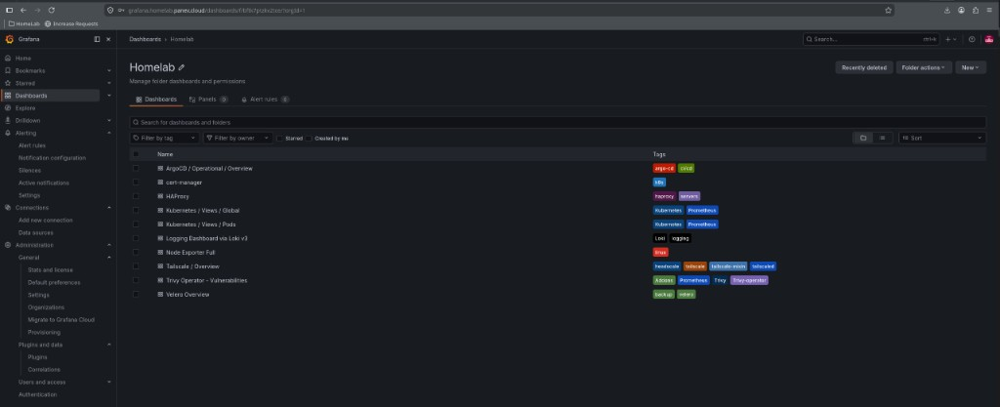
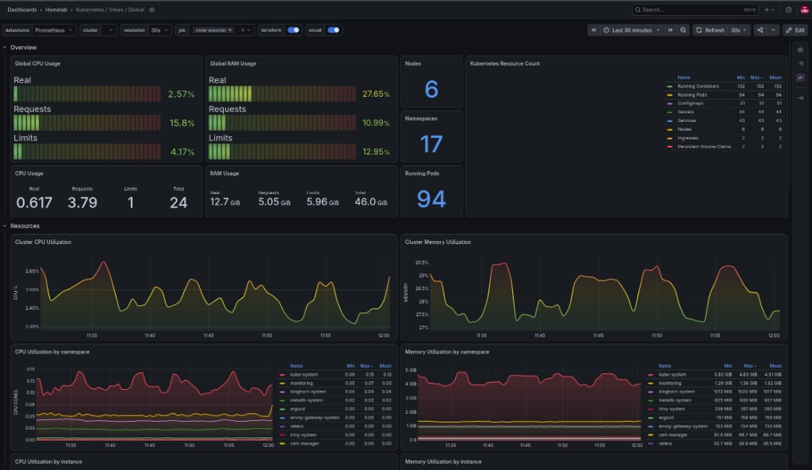

# PROMETHEUS_ENABLED

Deploys **kube-prometheus-stack** (Prometheus Operator, Prometheus, Grafana,
node-exporter, kube-state-metrics).





## Enable

```bash
PROMETHEUS_ENABLED=true
GRAFANA_ADMIN_PASSWORD=CHANGE_ME
GRAFANA_HOSTNAME=grafana
PROMETHEUS_HOSTNAME=prometheus
PROMETHEUS_RETENTION=15d
PROMETHEUS_WAIT_TIMEOUT=15m
```

## Behavior

- Namespace `monitoring`
- Grafana Homelab dashboards only (`defaultDashboardsEnabled: false`)
- Scrapes cluster + LB (HAProxy / node_exporter overlays)
- Needed for Loki datasource and Trivy / Tailscale exporter dashboards
- Gateway HTTPRoutes and, when enabled, parallel Tailscale Ingress URLs

## Configuration

| Variable | Description |
|----------|-------------|
| `GRAFANA_ADMIN_PASSWORD` | Grafana admin password |
| `PROMETHEUS_RETENTION` | TSDB retention |
| `GRAFANA_HOSTNAME` / `PROMETHEUS_HOSTNAME` | HTTPRoute labels |
| Helm values | `helm-homelab/prometheus/values.yaml` |

Dashboards (gnetId): K8s Views, Node Exporter, cert-manager, Argo CD, HAProxy,
Tailscale, Loki 24574, Trivy 16337, Velero 23838 — see values file.

## Verify

```bash
kubectl get pods -n monitoring
# LAN: https://grafana.<GATEWAY_DOMAIN>
# VPN: https://grafana.<TAILSCALE_TAILNET>
# LAN: https://prometheus.<GATEWAY_DOMAIN>
# VPN: https://prometheus.<TAILSCALE_TAILNET>
```

Grafana keeps the Gateway URL as its canonical `root_url`; its Tailscale URL is
an additional entry point and may redirect to the canonical URL.

## Related

- [alertmanager.md](alertmanager.md)
- [loki.md](loki.md)
- [../platform.md](../platform.md)
